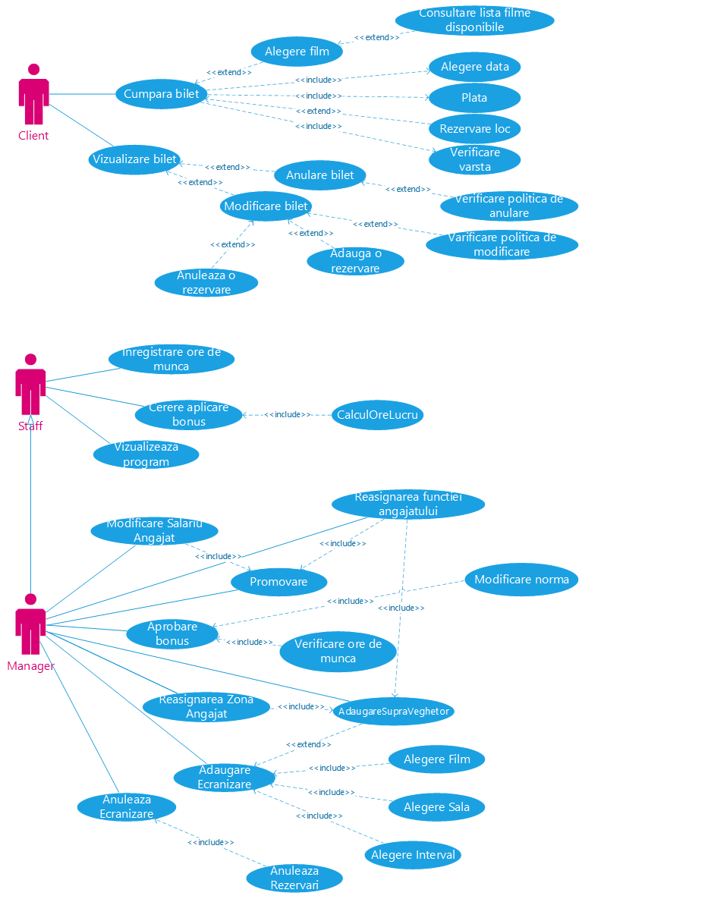
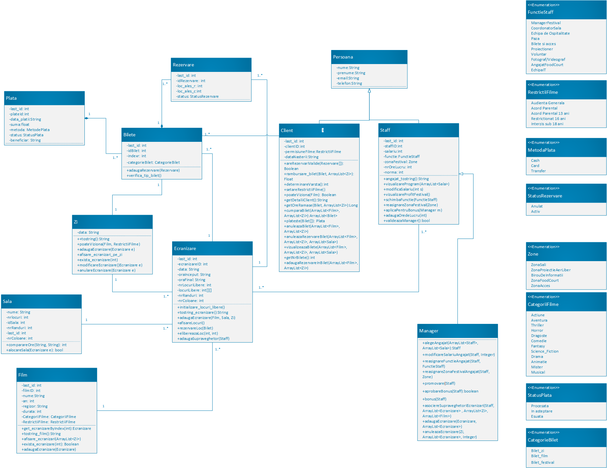
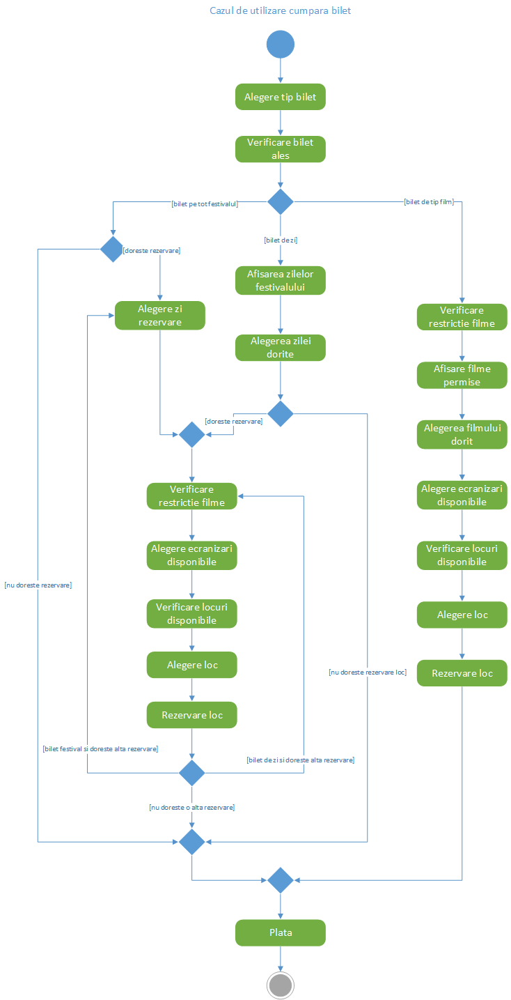
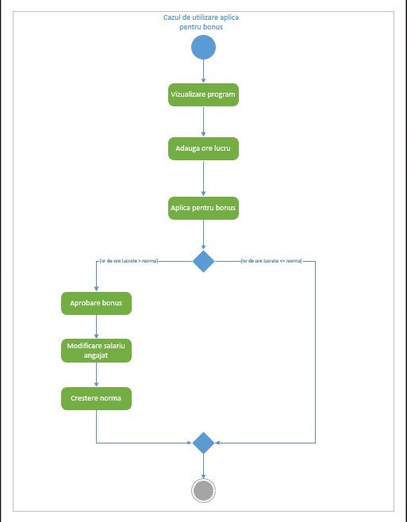
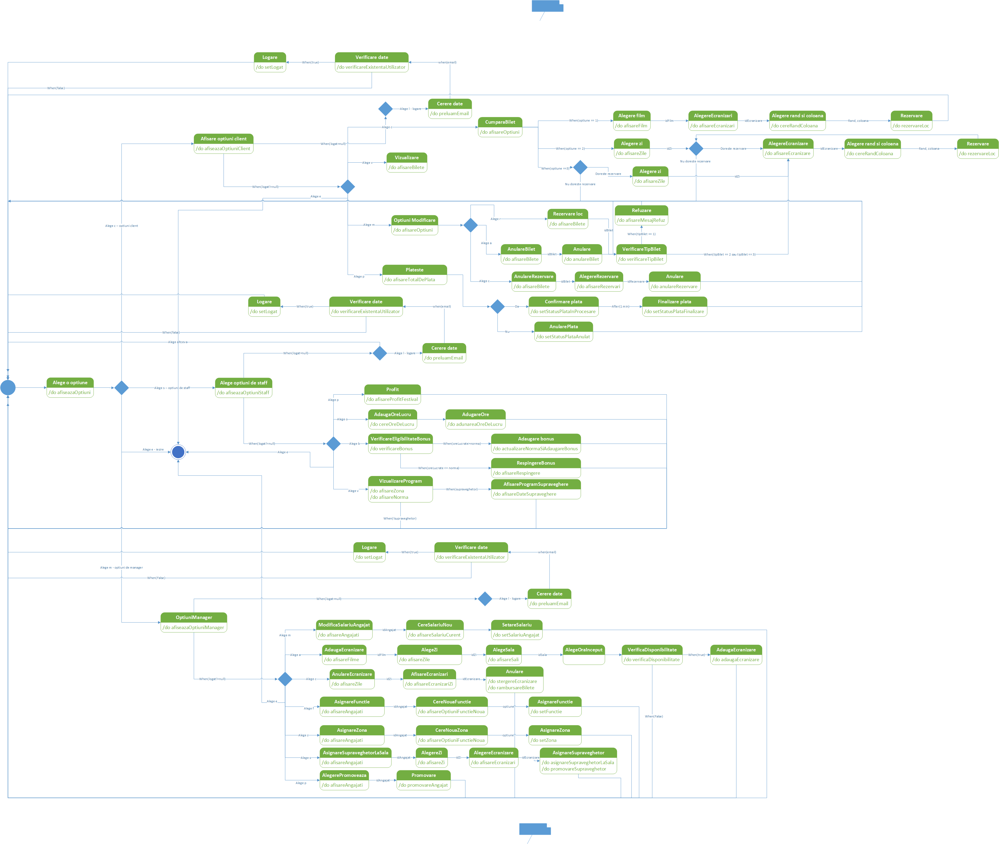
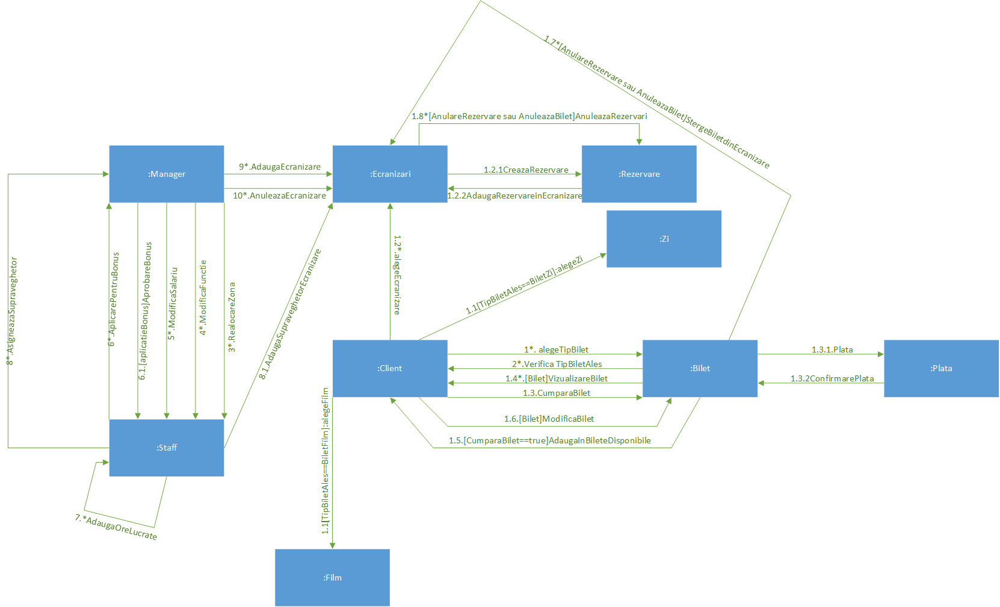
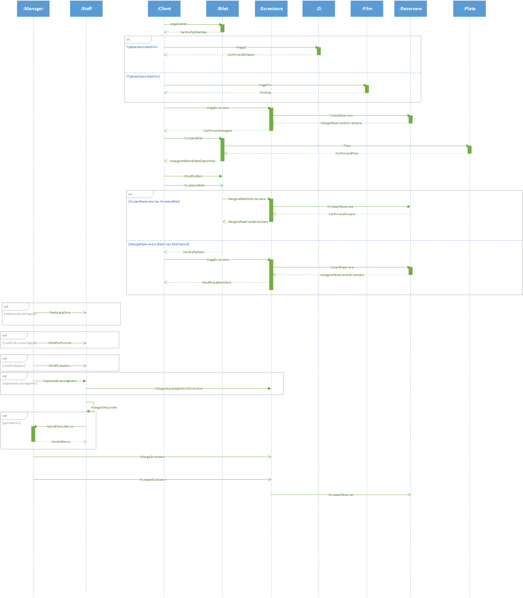

# FestivalFilme

**FestivalFilme** is a Java application designed to simulate and manage a film festival. It includes features for booking and purchasing tickets, managing staff and screening rooms, handling payments, and organizing films by categories and restrictions.

## Project Structure

- `src/classes/` – core classes:
    - `Client`, `Manager`, `Staff`
    - `Film`, `Ecranizare`, `Sala`, `Zi`, `Zone`
    - `Bilet`, `Rezervare`, `Plata`, `MetodaPlata`, `StatusPlata`, `StatusRezervare`
    - `CategorieBilet`, `CategoriiFilme`, `RestrictiiFilme`
    - `FunctieStaff`

- `src/tests/` – unit tests:
    - `ClientCumparaBiletTest.java`
    - `ClientRezervareTest.java`
    - `ManagerTest.java`

- `InterfataTest.java` – CLI interface for testing

## Features

- View film schedules and screenings
- Book and purchase tickets
- Calculate prices based on seating and ticket category
- Validate and process payments
- Manage staff roles and access
- Enforce age restrictions and prevent scheduling conflicts

## Technologies Used

- Java 
- JUnit 5
- Object-Oriented Programming (OOP)
- Git for bversion Control
- Visio for UML Diagrams

## UML Diagrams

This project includes a complete set of UML diagrams that describe the system architecture, behavior, and interactions:

### 1. Use Case Diagram
Describes the main interactions between users and the system.  

### 2. Class Diagram
Represents the classes, attributes, methods, and relationships in the system.  

### 3. Activity Diagram – Buy Ticket
Illustrates the workflow for the ticket purchase use case.  

### 4. Activity Diagram – View & Modify Ticket
Shows the flow of actions in the view ticket use case.  

### 5. Activity Diagram – Apply for Bonus
Another activity diagram detailing the flow of the apply for bonus case.

### 6. State Diagram
Shows the possible states and transitions of the system.  

### 7. Communication Diagram
Illustrates the interactions between objects.  

### 8. Sequence Diagram
Depicts the sequence of messages exchanged between objects over time.  

## Authors
- [@darianicoleduduna](https://github.com/darianicoleduduna)
- [@vladraresenache](https://github.com/vladraresenache)
- [@PaunAlexandra](https://github.com/PaunAlexandra)
This project was developed as part of the *Software Systems Engineering* course.
